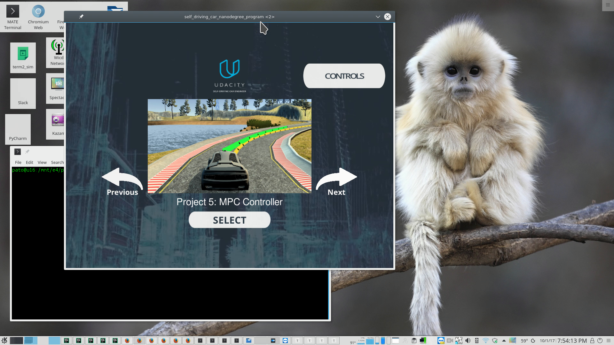

# Model Predictive Controller Project Write-Up

by [Patrick Poon](https://www.linkedin.com/in/patrickpoon/)


## Overview

The fifth project for Term 2 of Udacity's Self-Driving Car nanodegree program involves implementing a ***Model Predictive Controller*** to autonomously navigate a vehicle on a virtual track through a simulator.   The simulator provides state information about the vehicle as it traverses through the track.  Our challenge is to implement a Model Predictive Controller by consuming this data, calculating a proper steering angle and throttle value, and then feeding those values as actuator inputs back to the simulator to effectively navigate the vehicle around the track.


## Implementation

### The Model

For this project, we are working with a kinematic model, which, unlike a dynamic model, ignores external forces, such as gravity, mass, and tire forces.  At low to moderate speeds, they are sufficient for approximating real vehicle behavior.

As soon as we start the simulator, we continually receive data values of the current state of the vehicle as it moves through the track. This data includes the following:

- Cartesian map coordinates: `x` and `y`
- bearing, denoted by `psi` (ψ)
- velocity/speed (`v`)

The simulator also provides information about the car's actuators, specifically its steering angle, `delta` (δ) and throttle/accelerator position, denoted by `a` and mapped to values `1` for full accelerator and `-1` for full brake.

To update these state values to predict the trajectory path coordinates that would steer the vehicle to our desired path, I used the following equations in lines 112-117 in `MPC.cpp`:

```c++
fg[1 + x_start + t]    = x1 - (x0 + v0 * CppAD::cos(psi0) * dt);
fg[1 + y_start + t]    = y1 - (y0 + v0 * CppAD::sin(psi0) * dt);
fg[1 + psi_start + t]  = psi1 - (psi0 + v0 * delta0 / Lf * dt);
fg[1 + v_start + t]    = v1 - (v0 + a0 * dt);
fg[1 + cte_start + t]  = cte1 - ((f0 - y0) + (v0 * CppAD::sin(epsi0) * dt));
fg[1 + epsi_start + t] = epsi1 - ((psi0 - psides0) + v0 * delta0 / Lf * dt);

```

where the variables ending in `0` represent property's current state, and the ones ending in `1` represent the property's future time state.  `CppAD::` math library functions were used for automatic differentiation calculations.  Moreover, `cte` represents the cross-track error and `epsi` represents the orientation error.  Finally, `Lf` is the distance (in meters) between the front of the car and its center of gravity, providing the ability to factor the vehicle's turn rate.


### Timestep Length and Elapsed Duration (N & dt)

I set the number of time steps, `N`, and the time interval between time steps, `dt` in the `MPC.h` file.  Through manual testing, I found that setting `N` to 10 and `dt` to 0.2 provided the most stable ride.  Setting `N` below 8 or above 11 provided a dizzying and unstable driving experience.  Also, with my implementation, setting `dt` below 0.2 would cause the vehicle to behave erratically around turns.

Finding the proper combination of `N`and `dt` values that did not cause the vehicle to careen wildly through curves or into the lake proved to be quite challenging.


### Polynomial Fitting and MPC Preprocessing

As the vehicle drives through the track, the simulator continually provides two vectors, ptsx and ptsy, of global x and y coordinates that comprise a reference trajectory that indicates an ideal path that the vehicle should follow to successfully navigate the track.  These coordinates must be transformed to the car's orientation coordinate system, in order to compute where the car is heading, where we want it to go, and what actuator input values we should return to the simulator to have the car go where we want it to go. 

The transformations are performed in lines 97-106 of main.cpp, before a polynomial line is fitted to the reference trajectory points:
```c++
// Transform global ref coords to car
Eigen::VectorXd x(ptsx.size());
Eigen::VectorXd y(ptsy.size());

for (unsigned int i = 0; i < ptsx.size(); i++){
	x[i] = (ptsx[i] - px) * cos(psi) + (ptsy[i] - py) * sin(psi);
	y[i] = (ptsy[i] - py) * cos(psi) - (ptsx[i] - px) * sin(psi);
}

auto coeffs = polyfit(x, y, 3);
```


### Model Predictive Control with Latency

To add some realism, I accounted for the real-world latency that occurs from when we provide input values to actuators to when those values are acted upon.  For instance, there would be some lag from when we command the steering wheel actuator to turn left 10 degrees to when it actually turns the steering wheel.

This latency is handled in lines 111-115 in `main.cpp`, where I set it to 100 milliseconds:

```c++
double latency = 0.1;

psi = -(v * (steering_angle / Lf) * latency);
px = v * cos(psi) * latency;
py = v * sin(psi) * latency;
```

`psi`, `px`, and `py` are then used to calculate the cross-track error, `cte` and are fed into the `MPC::Solve` function through a new `state` input value to ultimately determine the proper steering angle and throttle value to send back to the actuators to move in our desired path.


## Final Thoughts

After having completed this project, I have gained an appreciation for the efficacy and power of using a Model Predictive Controller to maneuver a vehicle through a track, given the coordinates of a reference trajectory.  It seems far more effective than using a PID Controller or Behavioral Cloning (from Udacity's Self Driving Car nanodegree's Project 3 in Term 1).  I plan to use a combination of these methods when building a self-racing robocar through activities with the [Boston Self Driving Cars Meetup group](https://www.meetup.com/Boston-Self-Driving-Cars-Meetup/).

A video of my implementation can be viewed at https://youtu.be/x1Wqg1sV4Po:

[](https://youtu.be/x1Wqg1sV4Po)


